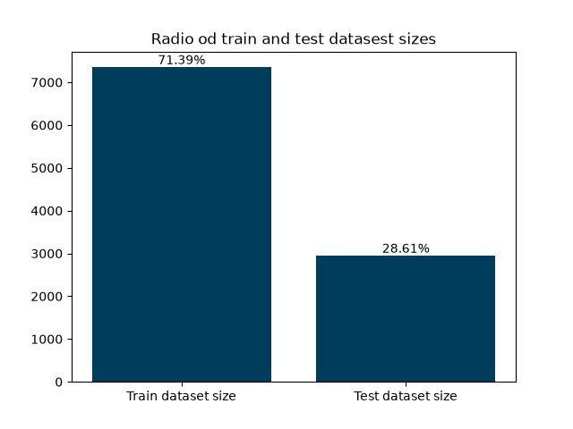
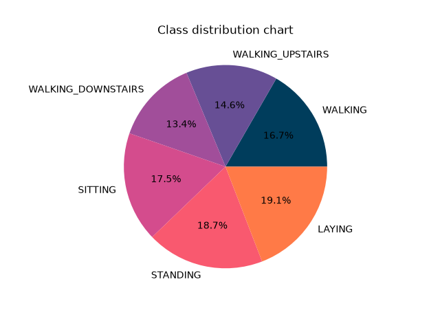
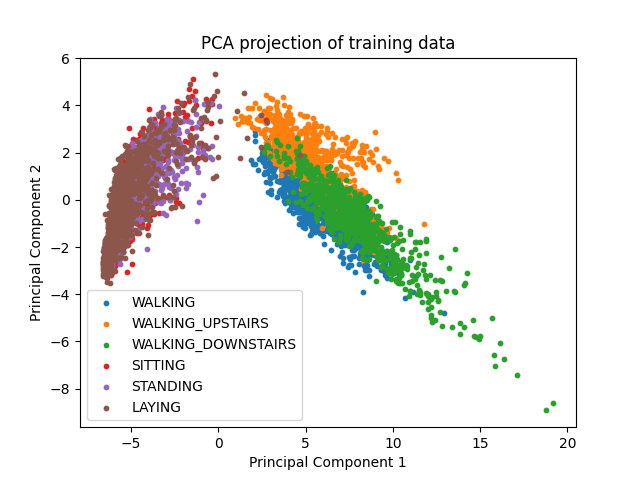
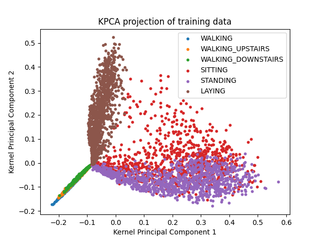
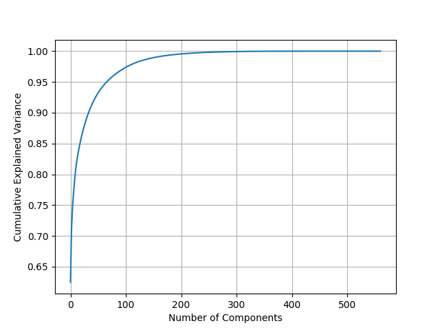

# Human Activity Recognition using Smartphone Sensors

Machine Learning course project focused on recognizing human activities from smartphone accelerometer and gyroscope data.

<!-- TODO Add additional info -->

## Team Members

- Marijana Čupović — 1018/2025
- Tanja Gavrić — 1065/2025

## Dataset

The project uses the [Human Activity Recognition Using Smartphones](https://archive.ics.uci.edu/dataset/240/human+activity+recognition+using+smartphones) dataset from the UCI Machine Learning Repository.

The dataset contains smartphone sensor measurements for six activities:

- Walking
- Walking upstairs
- Walking downstairs
- Sitting
- Standing
- Laying

<!-- TODO Add dataset properties. -->

## Methodology

### Data distribution

The data from 30 volunteers has been randomly split into **training and test** sets. As shown in the figure, approximately $70\%$ of the data has been assigned to the training set and $30\%$ to the test set. For **validation** purposes, $20\%$ of the training data has been randomly selected. 

The features are normalized and bounded within the interval $[-1, 1]$, as stated in the dataset description. Therefore, no additional standardization is required. The dataset contains no duplicate or missing values in either the training or the test set.

The **classes** are nearly balanced, with only minor variations. We would expect the same number of instances for the **WALKING_UPSTAIRS** and **WALKING_DOWNSTAIRS** classes, but there is a slight difference. One possible explanation is that it took the volunteers more time to climb upstairs than to descend, resulting in more sensor readings being recorded for the WALKING_UPSTAIRS class.

### Feature engineering

To explore the potential for dimensionality reduction, we applied both standard PCA and Kernel PCA (KPCA) to the 
feature 
space.
Projection of the training data onto the first two principal components reveals natural clustering for both techniques.

  
  

Static and dynamic activities are being particularly distinguishable. 

#### Variance analysis

The cumulative explained variance plot reveals that a significant number of components are needed to preserve most of the information, 
indicating that the 561 features contain significant non-redundant information about human activity patterns.

<!-- TODO Describe data analysis, preprocessing, train-validation-test split, models and hyperparameter selection -->

## Results

<!-- TODO Add evaluation metrics, confusion matrices, graphical model comparison and conclusions -->

## Installation

<!-- TODO Add setup instructions -->

## References

* Moore, J., & Ling, B.
  [Human Activity Recognition Using Smartphone Sensors](https://cs229.stanford.edu/proj2016/report/LingMoore-HumanActivityRecognitionUsingSmartphoneSensors-report.pdf).
  Stanford University, CS229 Final Project Report, 2016.

